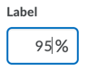

# My Component

This is my component. Here is a [link](https://www.google.ca). Here is a [relative link](./other-component.md). Here is an image:



Interactive Demo:
```html
<!-- docs: live demo -->
<script type="module">
  import '/assets/js/input-date.js';
</script>
<d2l-input-date label="Date Input"></d2l-input-date>
```

Secondary Demo:
```html
<!-- docs: demo -->
<script type="module">
  import '/assets/js/input-date.js';
</script>
<d2l-input-date
  label="Start Date"
  value="2020-11-20">
</d2l-input-date>
```

Code block:
```html
<script type="module">
  import '@brightspace-ui/core/components/inputs/input-date.js';
</script>
<d2l-input-date
  label="Start Date"
  value="2020-11-20">
</d2l-input-date>
```

**Accessibility:**

<!-- docs: start accessibility content -->
To make your usage of `d2l-component` accessible, use the following properties when applicable:

| Attribute | Description |
|--|--|
| `label` | Visible unless `label-hidden` is also used. |
| `label-hidden` | Use if label should be visually hidden but available for screen reader users |
<!-- docs: end accessibility content -->

<!-- docs: start hidden content -->
**Hidden Content:**

You should not see me!

| Test | Table |
|--|--|
| hello | I'm not here |
<!-- docs: end hidden content -->
